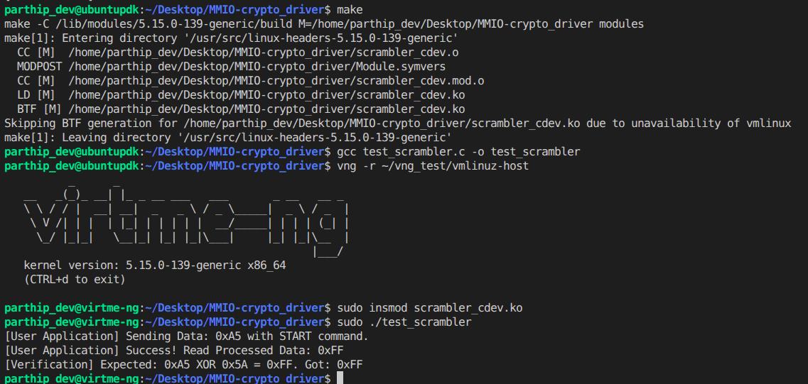

# MMIO-driver

## Simulated Crypto-Peripheral Linux Character Driver

A Linux Loadable Kernel Module (LKM) that emulates a hardware-based encryption accelerator via a custom character device layout. This project demonstrates core Linux kernel concepts including Memory-Mapped I/O (MMIO) mocking, POSIX file operations, concurrency control (Mutex), and kernel-to-userspace memory transfers.

## Hardware Register Layout

The driver allocates a 16-byte continuous memory block in kernel space to simulate a 32-bit hardware register array.

| Name | Index Offset | Bit-Level Flags & Functionality |
| :--- | :--- | :--- |
| `REG_DATA_IN` | `0` (0x00) | **Write-Only:** Holds the raw byte to process. |
| `REG_CTRL` | `1` (0x04) | **Read-Write:**<br>Bit 0 (`START`): Set to 1 to begin processing.<br>Bit 1 (`RESET`): Set to 1 to clear registers. |
| `REG_STATUS` | `2` (0x08) | **Read-Only:**<br>Bit 0 (`BUSY`): High during 10ms processing delay.<br>Bit 1 (`READY`): High when output data is valid. |
| `REG_DATA_OUT` | `3` (0x0C) | **Read-Only:** Holds processed data (Input XOR `0x5A`). |

## Driver Architecture Features

- **Concurrency Control:** Utilizes a standard Linux `mutex` to prevent race conditions during concurrent read/write operations on the simulated hardware registers.
- **Strict Memory Safety:** Uses `copy_to_user` and `copy_from_user` to safely bridge the virtual memory gap between kernel space and user space. Lock scopes are minimized during page-faultable operations.
- **Input Sanitization:** Masks user-supplied control bytes to prevent undefined hardware states and validates input/output lengths to prevent zero-length buffer overflows.
- **POSIX Compliance:** Implements proper return semantics (returning exact bytes consumed) and respects non-blocking (`O_NONBLOCK`) file descriptors by returning `-EAGAIN` when hardware is busy.

---
# Test Output :


---
# How to Build and Run

## Method A: Using QEMU / virtme-ng

## Environment Setup & Execution

This project utilizes **QEMU** and **virtme-ng** to create a safe, lightweight, virtualized sandbox.

### 1. Install Prerequisites (Ubuntu / Debian)

Kernel headers, build tools, QEMU emulator, and `virtme-ng`. Run the following on your host machine:

```bash
# Update packages and install build essentials & QEMU
sudo apt update
sudo apt install -y build-essential linux-headers-$(uname -r) qemu-system-x86

# Install virtme-ng 
sudo apt install -y virtme-ng
```
### 2. Compile the project

```bash
# Build the loadable kernel module (creates scrambler_cdev.ko)
make
# Compile the user-space verification app
gcc test_scrambler.c -o test_scrambler```
```
### 3. Boot the Sandbox (Sharing Host Filesystem)

```bash
vng -r ~/vng_test/vmlinuz-host
```

### 4. Load and test the driver
```bash

# 1. Insert the kernel module (Root privileges (sudo) are required to insert kernel modules and interact with raw device nodes.)
sudo insmod scrambler_cdev.ko

# 2. Check the kernel logs to ensure initialization succeeded
dmesg | tail -n 5

# 3. Run the user-space test application
sudo ./test_scrambler```
```
Expected Output:
```text
[User Application] Sending Data: 0xA5 with START command.
[User Application] Success! Read Processed Data: 0xFF
[Verification] Expected: 0xA5 XOR 0x5A = 0xFF. Got: 0xFF
```

### 5. Cleanup and Exit

```bash
# View the hardware simulation logs generated by the kernel
dmesg | tail -n 10

# Unload the module 
rmmod scrambler_cdev

# Exit the VM and return to your host machine
exit
```

> Pressing `Ctrl+d` also safely shuts down the virtme-ng vm and returns to the host.

---

